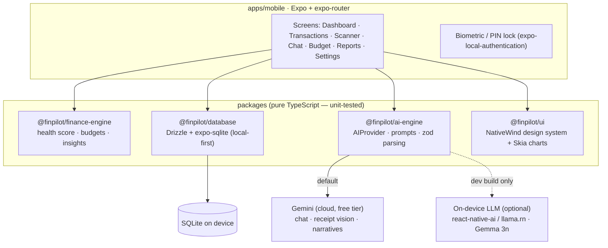

# 💸 FinPilot AI

> An AI-powered, **local-first** personal-finance copilot for React Native (Expo). Track spending, scan receipts with AI vision, chat with a finance-aware copilot, and get a **Financial Health Score** — with your data staying **on your device**.

<p align="left">
  
  
  
  
  
</p>

> 📱 _Screenshots / demo GIF coming — capture from a device build (see [Running it](#running-it))._

---

## Why it's different

Most expense trackers stop at *add → view → done*. FinPilot pairs **expense tracking** with **financial intelligence** and an **AI copilot** — and keeps everything **on-device** (SQLite), so your finances never leave your phone.

## Features

| | Feature | How it works |
|---|---|---|
| 🩺 | **Financial Health Score** *(headline)* | A 0–100 score + band (Poor/Fair/Good/Excellent) from savings rate, expense ratio, emergency-fund readiness & debt-to-income — each a documented, **unit-tested** formula, with AI-written explanations. |
| 💬 | **AI Chat** | A finance-aware copilot. "How much did I spend on food last month?" → grounded in your real on-device aggregates. |
| 🧾 | **Receipt Scanner** | Snap a photo → **Gemini vision** extracts `{merchant, amount, GST, date, category}` → auto-saved. |
| 📊 | **Monthly Report** | Income, expenses, savings, category breakdown + AI recommendations. |
| 🎯 | **Budget Planning** | "I want to save ₹10,000/month" → a feasible per-category budget. |
| 📈 | **Spending Insights** | Month-over-month category deltas, top movers & anomalies, explained by AI. |

## Architecture

A **pnpm monorepo**. The domain logic lives in pure-TypeScript packages (runnable & tested under Node, **zero React Native deps**); the Expo app is a thin, well-typed shell on top.



### The AI design — honest about on-device
The headline ask was **on-device AI**. Reality: on-device LLMs (`react-native-ai`/MLC, `llama.rn`/Gemma 3n) need a **custom EAS dev build + a physical device + a multi-GB model download** — they can't run in Expo Go or in CI. So FinPilot puts every AI capability behind one `AIProvider` interface with **two implementations**:

- **`GeminiProvider` (default)** — runs today on the **free Gemini tier**, multimodal (receipt vision), structured (zod-validated) JSON. This is the path you can run + verify immediately.
- **`OnDeviceProvider` (optional)** — fully wired, **lazily** loaded so it never breaks bundling, and switched on from **Settings** after a dev build. See [`docs/on-device.md`](docs/on-device.md).

You flip providers in **Settings** — same app, same prompts.

## Tech stack
**Mobile:** Expo SDK 56 · expo-router · React Native 0.85 (new arch) · TypeScript (strict). **UI:** NativeWind v4 · a shadcn-inspired component set · Victory Native XL + `@shopify/react-native-skia`. **Data:** expo-sqlite + **Drizzle ORM** (+ drizzle-kit migrations) · TanStack Query — **local-first**. **AI:** Google **Gemini** (`@google/genai`, free tier) + optional on-device LLM. **Auth:** `expo-local-authentication` (biometric) + PIN — a local lock, no account, no server.

## Monorepo layout
```
finpilot-ai/
├── apps/mobile/                 # Expo app (all screens, navigation, DB init, charts)
├── packages/
│   ├── finance-engine/          # health score · budgets · insights · categorizer (+ eval)
│   ├── database/                # Drizzle schema · migrations · DI repositories
│   ├── ai-engine/               # AIProvider · GeminiProvider · OnDeviceProvider · prompts · zod
│   └── ui/                      # NativeWind design system + Skia chart wrappers
├── docs/on-device.md            # how to enable on-device LLM (dev build)
└── .github/workflows/ci.yml
```

## Quality & verification

What's covered automatically (CI: `lint → typecheck → test → expo export`):

- **99 unit tests** across the core packages (finance-engine 54 · database 10 · ai-engine 35), runnable in Node with **no API key** — the database tests run real migrations + queries against in-memory `better-sqlite3`.
- **Finance-engine eval** (`pnpm eval`, pure logic): over 9 labelled synthetic profiles the health score hits **100% cross-tier ranking accuracy (27/27 pairs)** and **100% band-classification accuracy** on clear cases. (Reproduce: `pnpm eval`.)
- **`expo export`** bundles the full app to Hermes bytecode — the compile/bundle proof.

> Device-only behaviour (biometric unlock, camera, live Gemini calls, on-device LLM) is verified by typecheck + a successful bundle; exercise it on a device.

## Getting started

```bash
pnpm install            # Node 18+, pnpm 9 (corepack enable)
pnpm lint && pnpm typecheck && pnpm test && pnpm eval   # all green, no key needed
```

### Running it
1. Get a **free Gemini key** → https://aistudio.google.com/app/apikey
2. Either set `EXPO_PUBLIC_GEMINI_API_KEY` in `apps/mobile/.env` (dev) **or** paste the key in-app under **Settings** (stored in `expo-secure-store`).
3. `cd apps/mobile && npx expo start` → open in **Expo Go** for the cloud-AI experience (chat, receipt scan, insights).
4. **On-device LLM / camera / biometrics** need a dev build: `eas build --profile development`, install on a device, then toggle the provider in Settings. See [`docs/on-device.md`](docs/on-device.md).

> ⚠️ **Key handling:** calling Gemini directly from the client exposes the key on-device — fine for a personal app; a production deployment would proxy calls through a small backend. This is called out in-app.

## Engineering notes
- **Local-first by design** — finances live in on-device SQLite; the only network call is to Gemini (and that's optional/on-device-replaceable).
- **DI repositories** let the same data layer run under `better-sqlite3` in tests and `expo-sqlite` in the app.
- **Hermes bundling gotchas solved honestly:** the on-device provider's non-literal `import()` (which Hermes can't compile) is handled with an app-local Babel transform that preserves the provider's "needs a dev build" contract; the Node-only `better-sqlite3` path is aliased out of the mobile bundle via Metro `resolveRequest`. No feature was removed to make it bundle.

## License
MIT © 2026 Charan Goriparthi
