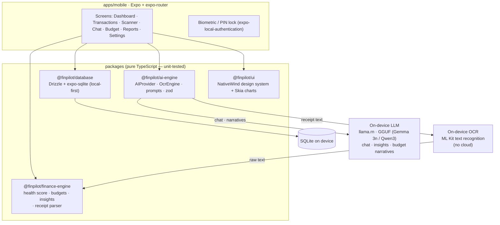

# 💸 FinPilot AI

> A **100% on-device** AI personal-finance copilot for React Native (Expo). Track spending, scan receipts with **on-device OCR**, chat with a finance-aware copilot powered by an **on-device LLM**, and get a **Financial Health Score** — with **nothing ever leaving your phone**. No cloud, no account, no API key.

<p align="left">
  
  
  
  
  
</p>

> 📱 _Screenshots / demo GIF coming — capture from a device build (see [Running it](#running-it))._

---

## Why it's different

Most expense trackers stop at *add → view → done*. FinPilot pairs **expense tracking** with **financial intelligence** and an **AI copilot** — and keeps **everything on the device**: your transactions live in local SQLite, the LLM runs on the phone, and receipt OCR runs on the phone. **No data ever leaves your device. There is no cloud, no API key, and no network call for any AI or OCR feature.**

## Features

| | Feature | How it works |
|---|---|---|
| 🩺 | **Financial Health Score** *(headline)* | A 0–100 score + band (Poor/Fair/Good/Excellent) from savings rate, expense ratio, emergency-fund readiness & debt-to-income — each a documented, **unit-tested** formula. Pure-local; runs everywhere. |
| 💬 | **AI Chat** | A finance-aware copilot running on an **on-device LLM** (`llama.rn`, GGUF). "How much did I spend on food last month?" → grounded in your real on-device aggregates. |
| 🧾 | **Receipt Scanner** | Snap a photo → **on-device OCR** reads the text → a pure-TypeScript parser extracts `{merchant, amount, GST, date, category}` → auto-saved. The image never leaves the phone. |
| 📊 | **Monthly Report** | Income, expenses, savings, category breakdown + on-device AI recommendations. |
| 🎯 | **Budget Planning** | "I want to save ₹10,000/month" → a feasible per-category budget (deterministic engine + optional on-device-LLM narrative). |
| 📈 | **Spending Insights** | Month-over-month category deltas, top movers & anomalies, explained by the on-device LLM. |

## Architecture

A **pnpm monorepo**. The domain logic lives in pure-TypeScript packages (runnable & tested under Node, **zero React Native deps**); the Expo app is a thin, well-typed shell on top. Every AI/OCR capability is on-device.



### The AI design — honest about on-device

Everything is on-device, behind two seams:

- **`OnDeviceProvider` (the only AI provider)** — chat, insight narratives, and budget narratives run on a quantized GGUF model via [`llama.rn`](https://github.com/mybigday/llama.rn). Structured outputs are validated with the existing zod schemas.
- **`OcrEngine` (on-device OCR)** — receipt text recognition via [`@react-native-ml-kit/text-recognition`](https://github.com/a7medev/react-native-ml-kit) (Google ML Kit, runs **on-device**, no network). A fully-OSS alternative (Tesseract) drops in behind the same interface — see [`docs/on-device.md`](docs/on-device.md).
- **`parseReceiptText`** — a pure-TypeScript, open-source receipt parser (no RN deps, **unit-tested** against real-world receipt fixtures) turns OCR text into `{merchant, amount, gst, date, category}`. It stands alone; the LLM can optionally refine ambiguous fields.

**Reality check (honest):** the on-device LLM and OCR native modules need a **custom EAS dev build + a physical device** (and the LLM needs a **multi-GB GGUF download**) — they can't run in Expo Go or in CI. So in Expo Go / a standard export, the **AI chat and receipt scanner** show a clear *"enable on-device AI in a dev build"* message, while **all local finance features keep working everywhere** (manual tracking, charts, the Financial Health Score, budget math, reports — all pure-local). The app **never** falls back to a cloud, because there is no cloud.

## Tech stack
**Mobile:** Expo SDK 56 · expo-router · React Native 0.85 (new arch) · TypeScript (strict). **UI:** NativeWind v4 · a shadcn-inspired component set · Victory Native XL + `@shopify/react-native-skia`. **Data:** expo-sqlite + **Drizzle ORM** (+ drizzle-kit migrations) · TanStack Query — **local-first**. **AI (on-device):** `llama.rn` (GGUF LLM) + `@react-native-ml-kit/text-recognition` (OCR) + a pure-TS receipt parser; zod-validated structured outputs. **Auth:** `expo-local-authentication` (biometric) + PIN — a local lock, no account, no server.

## Monorepo layout
```
finpilot-ai/
├── apps/mobile/                 # Expo app (all screens, navigation, DB init, charts)
├── packages/
│   ├── finance-engine/          # health score · budgets · insights · categorizer · receipt parser (+ eval)
│   ├── database/                # Drizzle schema · migrations · DI repositories
│   ├── ai-engine/               # AIProvider (on-device LLM) · OcrEngine (on-device OCR) · prompts · zod
│   └── ui/                      # NativeWind design system + Skia chart wrappers
├── docs/on-device.md            # how to enable the on-device LLM + OCR (dev build)
└── .github/workflows/ci.yml
```

## Quality & verification

What's covered automatically (CI: `build → lint → typecheck → test → expo export`):

- **Unit tests** across the core packages, runnable in Node with **no API key and no network** — including the new **receipt-parser tests** (13 real-world receipt-text fixtures, clean + messy). The database tests run real migrations + queries against in-memory `better-sqlite3`.
- **Finance-engine eval** (`pnpm eval`, pure logic): over 9 labelled synthetic profiles the health score hits **100% cross-tier ranking accuracy (27/27 pairs)** and **100% band-classification accuracy** on clear cases. (Reproduce: `pnpm eval`.)
- **`expo export`** bundles the full app to Hermes bytecode — the compile/bundle proof.

> Device-only behaviour (biometric unlock, camera, the on-device LLM, on-device OCR) is verified by typecheck + a successful bundle; exercise it on a device.

## Getting started

```bash
pnpm install            # Node 18+, pnpm 9 (corepack enable)
pnpm build              # build the library packages first
pnpm lint && pnpm typecheck && pnpm test && pnpm eval   # all green, no key/network needed
```

### Running it
1. `cd apps/mobile && npx expo start` → open in **Expo Go**. All **local finance features** work immediately: manual tracking, charts, the **Financial Health Score**, budget math, and reports — no key, no network.
2. **AI chat, receipt OCR, camera, and biometrics** need a dev build with the native modules + a model:
   ```bash
   cd apps/mobile
   npx expo install llama.rn @react-native-ml-kit/text-recognition
   eas build --profile development --platform ios   # or android
   ```
   Install it on a device, download a GGUF model into the app's documents dir, and the on-device AI/OCR light up. See [`docs/on-device.md`](docs/on-device.md).

> 🔒 **Privacy:** there is no cloud, no account, and no API key. Your transactions never leave the device, and neither do receipt images, OCR text, or chat prompts — the LLM and OCR run locally.

## Engineering notes
- **100% on-device by design** — finances live in on-device SQLite; chat/insights/budgets run on a local LLM; receipt OCR runs on-device. There is **no network code path** for any AI or OCR feature.
- **DI repositories** let the same data layer run under `better-sqlite3` in tests and `expo-sqlite` in the app.
- **Hermes bundling gotchas solved honestly:** the on-device LLM and OCR libs are loaded via a **non-literal `import()`** (which Hermes can't compile) neutralized by an app-local Babel transform that preserves their "needs a dev build" contract; the Node-only `better-sqlite3` path is aliased out of the mobile bundle via Metro `resolveRequest`. No feature was removed to make it bundle.

## License
MIT © 2026 Charan Goriparthi
